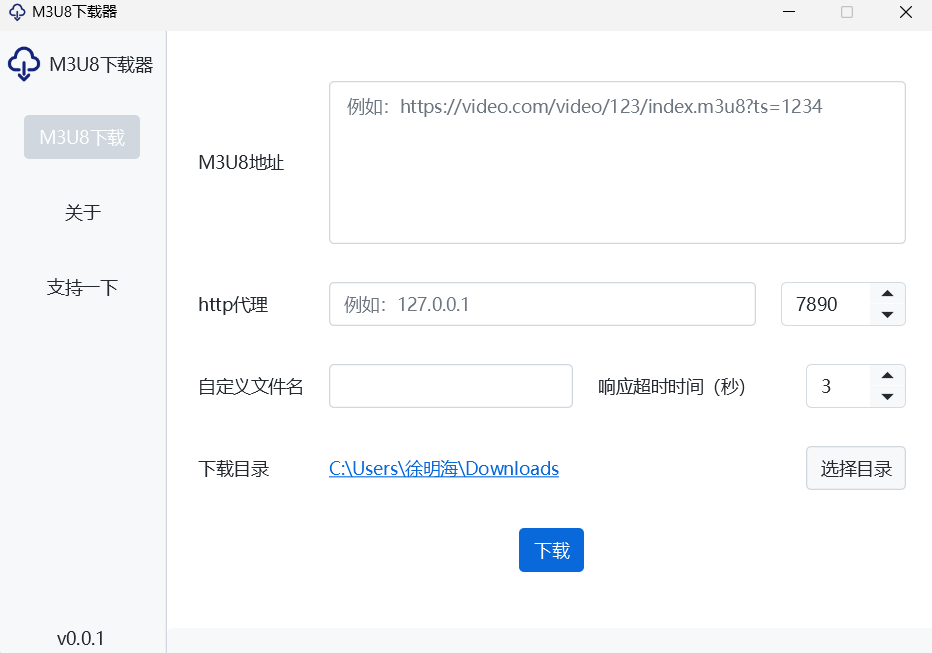

# M3U8下载器

使用Java开发的一款m3u8视频下载器，软件的目标是提供快速、完整、尽可能的将视频下载下来。

[软件发布地址](../../releases)

#### 软件特点

- 使用虚拟线程并发下载
- 支持http2、范围传输、内容压缩、根据服务器状态反应处理重试
- 支持http代理
- AES-128解密
- 可暂停，错误重试
- 自动合并为MP4

#### 软件截图

