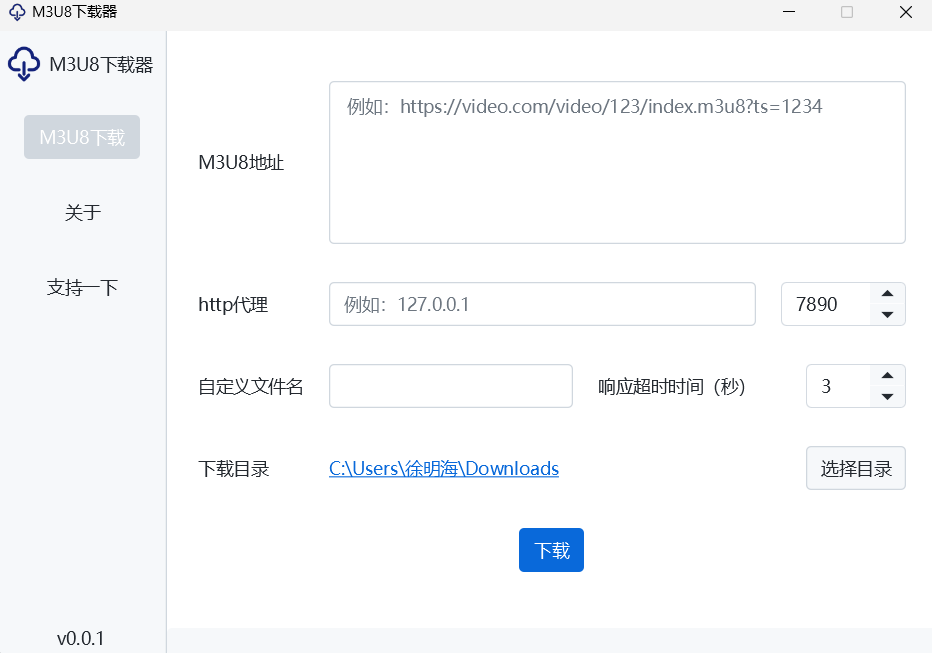
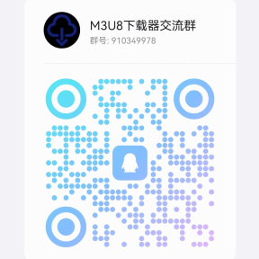

# M3U8 下载器

使用 Java 开发的 M3U8 视频下载桌面应用，目标是尽可能快速、完整地下载并合并视频。


## 功能特性

- 使用虚拟线程并发下载
- 支持 HTTP/2、范围传输、内容压缩和按服务端响应状态重试
- 支持 HTTP 代理
- 支持 AES-128 解密
- 支持暂停、错误重试
- 支持自动合并为 MP4

## 使用须知

本软件仅用于下载用户本人拥有、已获权利人授权或依法允许保存的内容。请勿将本软件用于未经许可
规避或破坏 DRM、付费访问限制及其他版权保护技术措施，也不得下载、复制或传播侵权内容。

用户应自行确认内容来源、授权范围和使用方式是否合法，并对自己的下载及后续使用行为负责。

## 软件截图



## 下载

请从 [GitHub Releases](../../releases) 下载已发布版本。

## 开发环境

- JDK 26
- Maven Wrapper
- IntelliJ IDEA

项目已提交 Maven Wrapper，首次构建无需单独安装 Maven。

Windows：

```shell
./mvnw.cmd test
```

Linux 或 macOS：

```shell
./mvnw test
```

## 本地构建

运行测试：

```shell
./mvnw.cmd test
```

生成当前平台便携版：

```shell
./mvnw.cmd clean verify -P portable
```

构建完成后主要产物：

- `target/jpackage/m3u8-downloader/`：可直接运行的便携版应用目录，内置精简 Java Runtime。
- `target/m3u8-downloader-0.0.2-<platform>.zip`：便携版压缩包，解压后即可运行。

注意：`jpackage` 只能生成当前操作系统对应的平台应用目录。例如 Windows 上生成 Windows 便携版，macOS 上生成 macOS 便携版。

## 多平台发布

项目使用 GitHub Actions 自动构建以下便携版产物：

- `windows-x86_64`
- `linux-x86_64`
- `linux-arm64`
- `macosx-x86_64`
- `macosx-arm64`

推送 `v*` tag 时，CI 会自动创建或更新 GitHub Release，并上传各平台 zip 和 sha256 校验文件。

## 贡献

提交 issue 或 pull request 前，请阅读 [CONTRIBUTING.md](CONTRIBUTING.md)。

安全问题请阅读 [SECURITY.md](SECURITY.md)，不要通过公开 issue 披露敏感漏洞。

## 项目维护

- 发布流程：[docs/release-checklist.md](docs/release-checklist.md)
- 分支保护建议：[docs/branch-protection.md](docs/branch-protection.md)
- 版本记录：[CHANGELOG.md](CHANGELOG.md)

## 许可证

Copyright (C) 2024 xuMingHai。

本项目采用 [GNU General Public License v3.0 or later](LICENSE) 许可证发布，对应 SPDX 标识为
`GPL-3.0-or-later`。

发布包包含的第三方开源组件及其许可证见 [第三方软件声明](THIRD-PARTY-NOTICES.md)。

## 项目地址

- [GitHub](https://github.com/xuMingHai1/m3u8-downloader)
- [Gitee](https://gitee.com/xuMingHai1/m3u8-downloader)

## QQ 交流群


